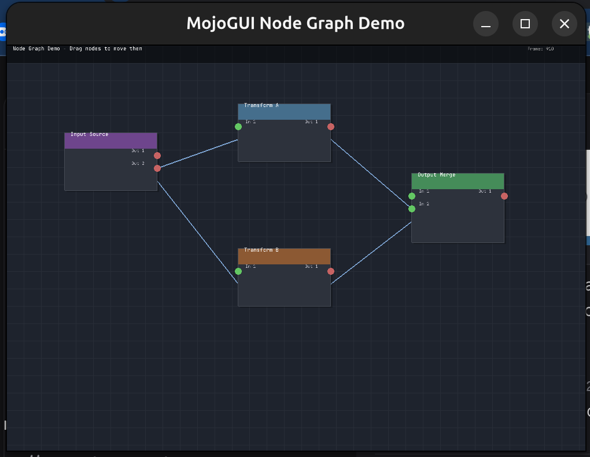

# MojoGUI - GUI Framework for Mojo

A GUI framework for Mojo with minimal FFI, keeping only essential OpenGL rendering primitives in C while implementing all widget logic in pure Mojo.

## Screenshots

### Node Graph Demo


*Visual node editor with draggable nodes, connections, and real-time rendering*

## Quick Start

```bash
# Build C library
cd c_src && make

# Run demos
pixi run mojo node_graph_demo.mojo
pixi run mojo enhanced_checkbox_demo.mojo
```

## Architecture

```
┌─────────────────────────────────────────┐
│               Mojo Layer                │
├─────────────────────────────────────────┤
│  • Widget System (Pure Mojo)           │
│  • Event Handling (Pure Mojo)          │
│  • Layout Management (Pure Mojo)       │
│  • Application Logic (Pure Mojo)       │
├─────────────────────────────────────────┤
│            FFI Boundary                 │
├─────────────────────────────────────────┤
│  • Minimal C Interface                  │
│  • OpenGL Rendering Primitives Only    │
│  • Colors: Float32 0.0-1.0 range       │
│  • No Complex Structs in FFI           │
└─────────────────────────────────────────┘
```

## Key Features

- **Minimal FFI Surface**: Only basic rendering primitives cross the FFI boundary
- **Memory Safe**: Complex widget logic stays in Mojo
- **TTF Font Support**: Professional font rendering with stb_truetype
- **Mojo 0.26.x Compatible**: Updated syntax (`comptime`, `out self`, `mut self`)

## Project Structure

```
mojo-gui/
├── c_src/                           # C rendering backend
│   ├── rendering_with_fonts.c       # OpenGL + TTF font rendering
│   └── librendering_with_fonts.so   # Compiled library
├── mojo_src/                        # Pure Mojo modules
│   ├── rendering_int.mojo           # Integer API wrapper
│   ├── theme_system.mojo            # Theme colors
│   └── widgets/                     # Widget implementations
├── node_graph_demo.mojo             # Visual node editor demo
├── enhanced_checkbox_demo.mojo      # Checkbox styles demo
└── screenshots/                     # Demo screenshots
```

## C Interface

Colors use Float32 in 0.0-1.0 range for OpenGL:

```c
int set_color(float r, float g, float b, float a);  // 0.0-1.0 range
int draw_filled_rectangle(float x, float y, float w, float h);
int draw_text(const char* text, float x, float y, float size);
int draw_line(float x1, float y1, float x2, float y2, float thickness);
```

## FFI Pattern

```mojo
from sys.ffi import OwnedDLHandle as DLHandle
from memory import alloc, UnsafePointer
from builtin.type_aliases import MutExternalOrigin

fn null_terminated_string(text: String) -> UnsafePointer[Int8, MutExternalOrigin]:
    var bytes = text.as_bytes()
    var buffer = alloc[Int8](len(bytes) + 1)
    for i in range(len(bytes)):
        buffer[i] = Int8(bytes[i])
    buffer[len(bytes)] = 0
    return buffer

fn main() raises:
    var lib = DLHandle("./c_src/librendering_with_fonts.so")
    var set_color = lib.get_function[fn(Float32, Float32, Float32, Float32) -> Int32]("set_color")

    # Colors normalized: RGB 128,128,128 -> 0.5, 0.5, 0.5
    _ = set_color(0.5, 0.5, 0.5, 1.0)
```

## Demos

| Demo | Description |
|------|-------------|
| `node_graph_demo.mojo` | Visual node editor with draggable nodes and bezier connections |
| `enhanced_checkbox_demo.mojo` | Square and round checkbox styles with colors |
| `delphi_ide_demo.mojo` | IDE-style interface with panels |

## Current Status

- Working with Mojo 0.26.x syntax
- TTF font rendering functional
- Node graph demo fully operational
- Direct FFI pattern (no module imports needed)

## Requirements

- Mojo 0.26.x+
- OpenGL/GLFW
- pixi (for environment management)
